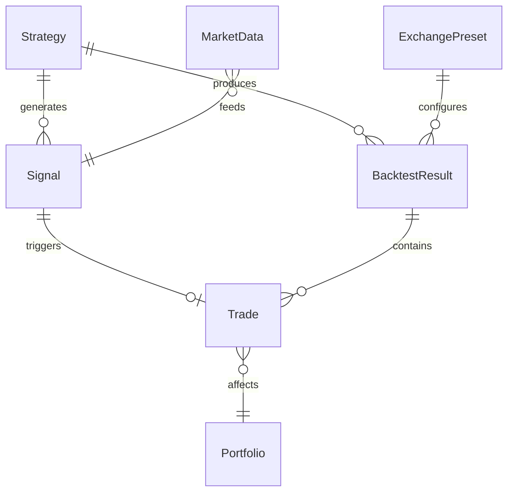

# Data Model: Cryptocurrency Backtesting System

## Core Entities

### 1. Strategy
전략 정의 및 메타데이터를 관리하는 핵심 엔티티

```python
@dataclass
class Strategy:
    """Trading strategy definition"""
    id: str                    # UUID
    name: str                  # e.g., "RSI_Momentum_v2"
    version: str               # Semantic versioning
    strategy_type: str         # "momentum", "mean_reversion", etc.
    parameters: dict           # Strategy-specific parameters
    created_at: datetime
    updated_at: datetime
    author: str
    description: str
    pine_script_path: str      # Path to Pine Script file
    
    # Validation
    min_capital: float = 1000.0
    max_positions: int = 1
    
    # State transitions
    status: Literal['draft', 'testing', 'active', 'deprecated']
```

### 2. MarketData
OHLCV 시계열 데이터

```python
@dataclass
class MarketData:
    """Historical price data"""
    symbol: str                # "BTC/USDT", "ETH/USDT"
    exchange: str              # "binance"
    timeframe: str             # "1m", "5m", "1h", "1d", etc.
    timestamp: datetime
    open: Decimal
    high: Decimal
    low: Decimal
    close: Decimal
    volume: Decimal
    quote_volume: Decimal      # Volume in quote currency
    trades_count: int          # Number of trades
    
    # Data quality
    is_complete: bool          # No missing data
    is_validated: bool         # Passed quality checks
```

### 3. Signal
전략이 생성하는 거래 신호

```python
@dataclass
class Signal:
    """Trading signal generated by strategy"""
    id: str
    strategy_id: str
    symbol: str
    timestamp: datetime
    signal_type: Literal['buy', 'sell', 'hold']
    strength: float            # -1.0 to 1.0
    confidence: float          # 0.0 to 1.0
    
    # Entry conditions
    entry_price: Decimal
    stop_loss: Decimal
    take_profit: Decimal
    position_size: Decimal
    
    # Metadata
    indicators: dict           # Indicator values at signal time
    reason: str               # Human-readable explanation
```

### 4. Trade
실행된 거래 기록

```python
@dataclass
class Trade:
    """Executed trade record"""
    id: str
    strategy_id: str
    signal_id: str
    symbol: str
    side: Literal['long', 'short']  # Initially long only
    
    # Entry
    entry_time: datetime
    entry_price: Decimal
    entry_commission: Decimal
    
    # Exit
    exit_time: Optional[datetime]
    exit_price: Optional[Decimal]
    exit_commission: Optional[Decimal]
    exit_reason: Optional[str]  # "stop_loss", "take_profit", "signal"
    
    # Position
    quantity: Decimal
    value: Decimal              # Position value in quote currency
    
    # Results
    pnl: Optional[Decimal]      # Profit/Loss
    pnl_percent: Optional[float]
    duration: Optional[timedelta]
    max_drawdown: Optional[float]
    
    # State
    status: Literal['open', 'closed', 'cancelled']
```

### 5. Portfolio
포트폴리오 상태 스냅샷

```python
@dataclass
class Portfolio:
    """Portfolio state at a point in time"""
    timestamp: datetime
    strategy_id: str
    
    # Capital
    initial_capital: Decimal
    cash: Decimal
    positions_value: Decimal
    total_value: Decimal
    
    # Positions
    open_positions: List[str]  # Trade IDs
    position_count: int
    
    # Performance
    returns: float              # Cumulative returns
    drawdown: float            # Current drawdown
    
    # Risk metrics
    exposure: float            # % of capital in positions
    leverage: float            # Always 1.0 for spot
```

### 6. BacktestResult
백테스트 실행 결과

```python
@dataclass
class BacktestResult:
    """Complete backtest results"""
    id: str
    strategy_id: str
    
    # Configuration
    symbol: str
    timeframe: str
    start_date: datetime
    end_date: datetime
    initial_capital: Decimal
    commission_preset: str      # "binance", "coinbase", etc.
    
    # Summary metrics
    total_return: float
    annual_return: float
    sharpe_ratio: float
    sortino_ratio: float
    max_drawdown: float
    win_rate: float
    profit_factor: float
    
    # Trade statistics
    total_trades: int
    winning_trades: int
    losing_trades: int
    avg_trade_return: float
    best_trade: Trade
    worst_trade: Trade
    avg_trade_duration: timedelta
    
    # Time series
    equity_curve: List[float]
    drawdown_series: List[float]
    trades: List[Trade]
    
    # Metadata
    created_at: datetime
    execution_time: float       # Backtest runtime in seconds
    data_quality_score: float
```

### 7. ExchangePreset
거래소별 수수료 및 제약사항

```python
@dataclass
class ExchangePreset:
    """Exchange-specific configuration"""
    name: str                   # "binance", "coinbase"
    maker_fee: Decimal          # 0.001 = 0.1%
    taker_fee: Decimal
    slippage: Decimal          # Estimated slippage
    
    # Constraints
    min_order_size: dict       # Per symbol
    tick_size: dict           # Price precision
    lot_size: dict           # Quantity precision
    
    # Rate limits
    requests_per_minute: int
    orders_per_day: int
```

## Relationships



## State Transitions

### Trade Lifecycle
```
Created → Open → [Closing] → Closed
                     ↓
                 Cancelled
```

### Strategy Status
```
Draft → Testing → Active → Deprecated
          ↓
      [Revision] → Draft
```

## Validation Rules

1. **Strategy**:
   - Name must be unique per version
   - Parameters must be JSON-serializable
   - Pine Script path must exist

2. **MarketData**:
   - OHLC relationship: Low ≤ Open, Close ≤ High
   - Volume ≥ 0
   - Timestamp must be UTC

3. **Trade**:
   - Entry price must match market data
   - Commission must be positive
   - PnL calculated after exit

4. **Portfolio**:
   - Cash + Positions Value = Total Value
   - Exposure ≤ 100% (no leverage)
   - Drawdown ≤ 0

## Storage Strategy

### Primary Storage (SQLite)
- Strategy definitions
- Trade records
- Backtest results
- Portfolio snapshots

### Time-Series Storage (Parquet/CSV)
- MarketData (partitioned by symbol/timeframe)
- Equity curves
- Signal history

### Cache Layer (Redis/Memory)
- Recent market data
- Active strategies
- Live portfolio state

## Performance Considerations

1. **Indexing**:
   - MarketData: (symbol, timeframe, timestamp)
   - Trade: (strategy_id, status, entry_time)
   - Signal: (strategy_id, timestamp)

2. **Partitioning**:
   - MarketData by year/month
   - Trades by strategy_id

3. **Compression**:
   - Parquet for historical data
   - Gzip for API responses

## Migration Path for Trading Bot

현재 백테스팅 전용 모델은 향후 실거래 봇으로 확장 시:

1. **Order** 엔티티 추가 (주문 관리)
2. **Execution** 엔티티 추가 (체결 내역)
3. **RiskLimit** 엔티티 추가 (실시간 리스크 관리)
4. **WebSocket** 이벤트 모델 추가

이 설계는 확장 가능하면서도 현재 요구사항에 집중합니다.